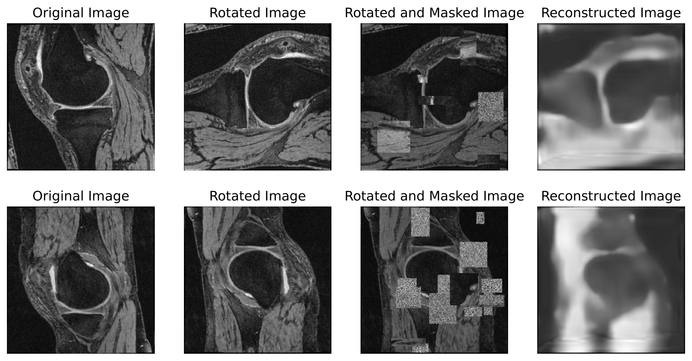
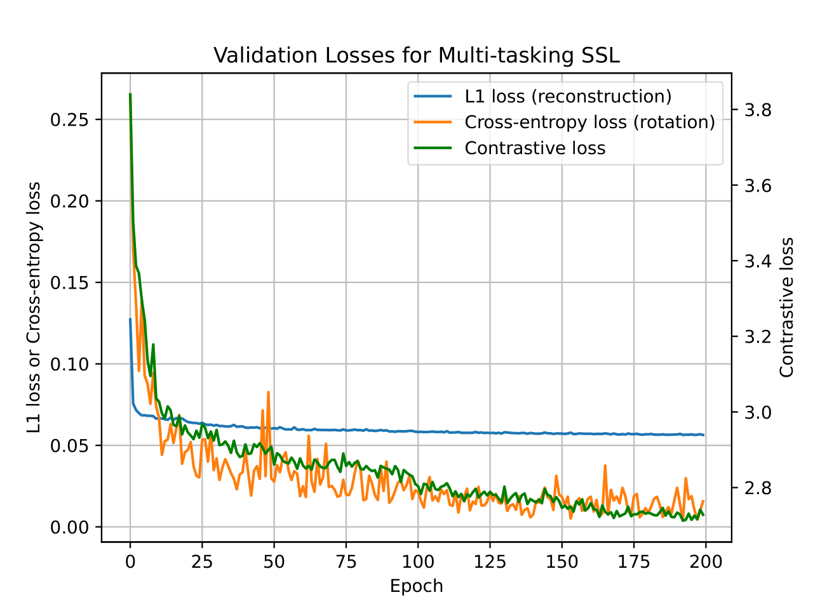
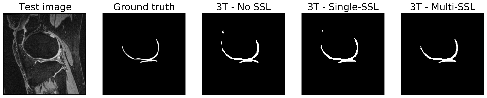
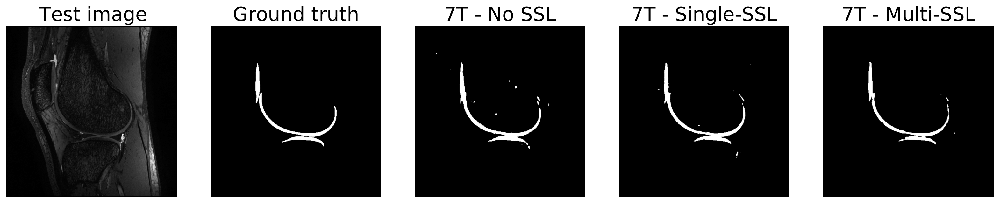

# Self-Supervised Learning of Swin Transformer for Automated Cartilage Segmentation on 7 Tesla Knee MRI
Master's Thesis for MEng Biomedical Engineering, Imperial College London 

This study focuses on developing an automated cartilage segmentation framework for a limited amount of 7 Tesla (7T) ultra-high-resolution knee MRI. To address the small dataset problem, we utilised the technique of self-supervised learning (SSL) of a [Swin Transformer (SwinT)](https://openaccess.thecvf.com/content/ICCV2021/html/Liu_Swin_Transformer_Hierarchical_Vision_Transformer_Using_Shifted_Windows_ICCV_2021_paper) on the abundant unlabelled 3T knee MRI available from the [Osteoarthritis Initiative (OAI)](https://nda.nih.gov/oai/). The aim is to achieve the gold standard segmentations that facilitate future use in cartilage thickness quantification for early-stage Knee Osteoarthritis detection. Another key objective is to achieve data efficiency by maintaining model performance under a reduced amount of 7T MRI. The training process involves two stages, SSL pretraining of SwinT and supervised downstream segmentation of 2D [Swin-UNETR](https://link.springer.com/chapter/10.1007/978-3-031-08999-2_22). Details of the training can be found in `Report.pdf`. 

All computations were performed using Python with the PyTorch framework (version 1.8.0). The [MONAI](https://github.com/Project-MONAI/MONAI) (Medical Open Network for AI) library had to be installed to provide classes for evaluation metrics and loss functions etc. Codes for the SwinT, Swin-UNETR and loss functions were adapted from the source codes of [Self-Supervised Pre-Training of Swin Transformers
for 3D Medical Image Analysis](https://openaccess.thecvf.com/content/CVPR2022/papers/Tang_Self-Supervised_Pre-Training_of_Swin_Transformers_for_3D_Medical_Image_Analysis_CVPR_2022_paper.pdf) available in [Project MONAI research](https://github.com/Project-MONAI/research-contributions/tree/main/SwinUNETR/Pretrain). 

## Stage 1: SSL Pretraining

Stage 1 involves SSL pretraining (single-tasking and multi-tasking SSL) on 2D unlabelled 3T MRI images from [the OAI database](https://nda.nih.gov/oai/) (see `SSLPretrain/OAI_all/dataset.json` for data storing format). Related codes are stored in the `SSLPretrain` directory. 

|File                   |Description          
|----                   |------------             
|`OAIquery.ipynb`       |Preprocessing of [the OAI database](https://nda.nih.gov/oai/) and image slices extraction
|`main_singleSSL.py`    |Single-tasking SSL pretraining 
|`main_multiSSL.py`     |Multi-tasking SSL pretraining
|`SSLResults.ipynb`     |SSL pretraining results evaluation

## Stage 2: Supervised Downstream Segmentation

Stage 2 involves downstream segmentation on 2D labelled 3T MRI and 7T (target) MRI respectively (see `Segmentation/3TOAIdataset/3TMRI_dataset_1.json` and `Segmentation/7TMRIs/7TMRI_dataset.json` for data storing format). Related codes are stored in the `Segmentation` directory. 

|File                     |Description          
|----                     |------------             
|`3TOAIdataloader.ipynb`  |Preprocessing of [the 3T OAI Challenge Dataset](https://www.ncbi.nlm.nih.gov/pmc/articles/PMC8231759/) and image slices extraction
|`7Tdataloader.ipynb`     |Preprocessing of the 7T MRI and image slices extraction
|`main.py`                |Downstream segmentation training
|`Test.ipynb`             |Segmentation Prediction on the test dataset and model comparisons

## Results
### Stage 1: SSL Pretraining
Image Inpainting task in Single-tasking SSL Pretraining:

Image Inpainting task in Multi-tasking SSL Pretraining:

Validation loss curves of all three pretext tasks in Multi-tasking SSL Pretraining:

### Stage 2: Supervised Downstream Segmentation
The best performance is achieved with multi-tasking SSL pretrained model on 7T MRI with a Dice score of 0.938.

|Experiment                 |Dice on 3T OAI Challenge Dataset       |Dice on 7T MRI Dataset
|-----                      |--------------------------------       |----------------------
|1. No SSL                  |0.888                                  |0.928
|2. Single-tasking SSL      |0.902                                  |0.932
|**3. Multi-tasking SSL**   |**0.903**                              |**0.938**

Example of 3T cartilage segmentation prediction:

Example of 7T cartilage segmentation prediction:

